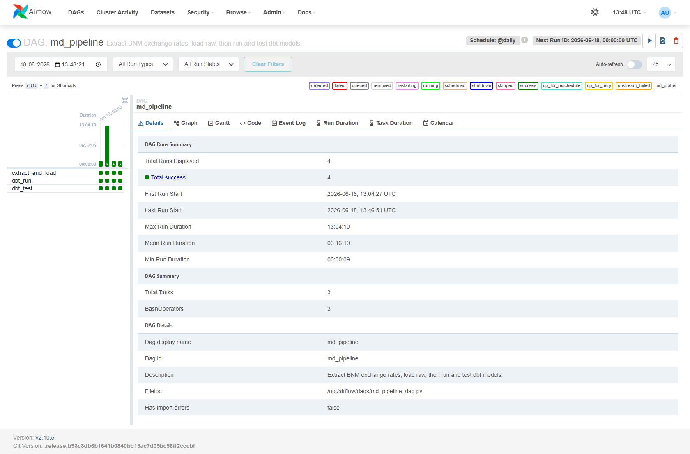
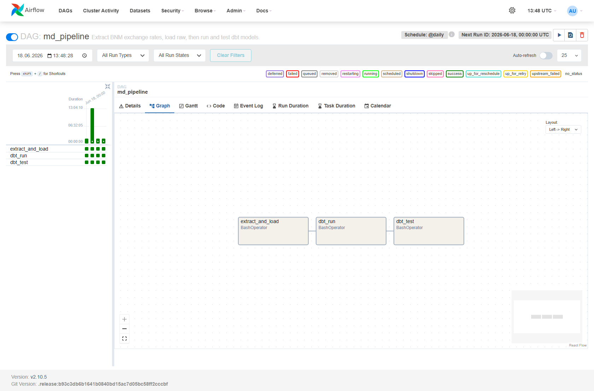
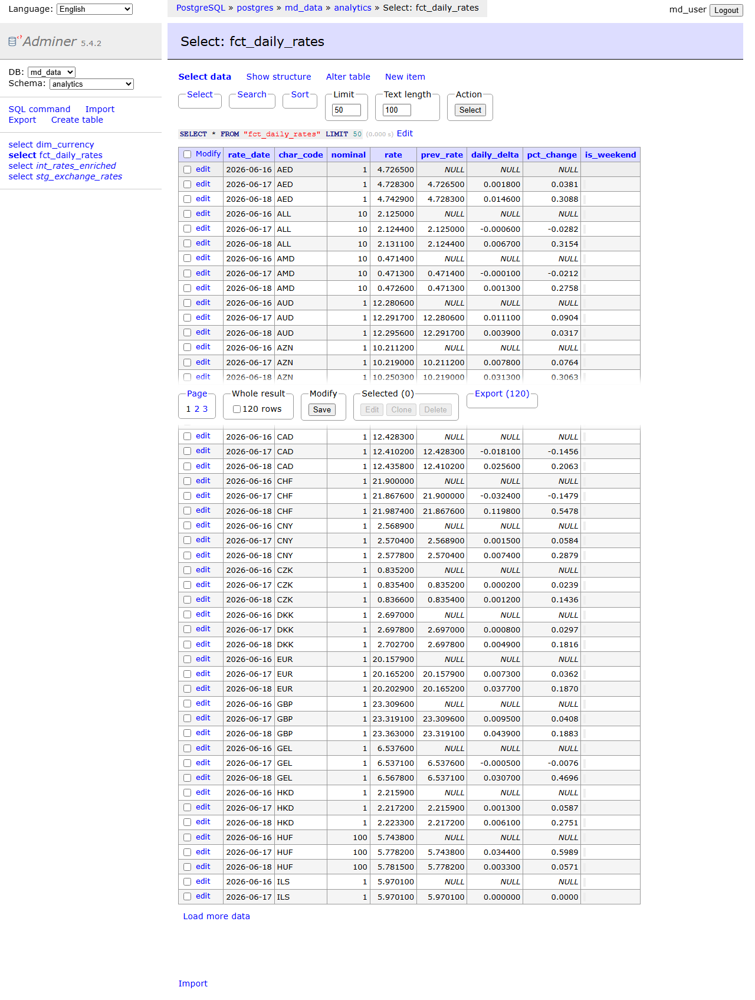

# BNM Exchange Rates — ELT Pipeline

[](https://github.com/danmorcov88/bnm-exchange-rates-elt/actions/workflows/ci.yml)


An end-to-end ELT pipeline that extracts the official daily exchange rates
published by the National Bank of Moldova (BNM), loads them into a PostgreSQL
warehouse, and transforms them through layered dbt models into an analytics-ready
star schema. Apache Airflow orchestrates the whole flow on a daily schedule, and
the entire stack runs locally with a single Docker command. It is a self-contained
portfolio project: public data, isolated containers, no external infrastructure.

## Architecture


The pipeline extracts daily rates from the BNM API, lands them in the `raw`
schema, transforms them through dbt staging, intermediate, and mart layers in the
`analytics` schema, and exposes the results for querying. An Airflow DAG runs the
three steps in order on a daily schedule. The mermaid source is in
`docs/architecture.mmd`.

## Tech stack

| Layer | Technology | Role |
|---|---|---|
| Ingestion | Python 3.11 (`requests`, `psycopg2`) | Extract from the BNM API, load raw |
| Warehouse | PostgreSQL 16 | Storage and transformations |
| Transformation | dbt-postgres | Layered modeling and data tests |
| Orchestration | Apache Airflow 2.10 (LocalExecutor) | Scheduling and dependencies |
| Containerization | Docker Compose | Reproducible local stack |
| CI | GitHub Actions | sqlfluff lint, dbt compile and build |
| Exploration | Adminer | Browse the warehouse |

## Run locally

Prerequisites: Docker Desktop (Compose v2). No local Python or Postgres required
to run the stack.

Create a `.env` file in the project root:

```bash
# Data warehouse
POSTGRES_USER=md_user
POSTGRES_PASSWORD=md_password
POSTGRES_DB=md_data
POSTGRES_HOST=localhost
POSTGRES_PORT=5433

# Airflow metadata database (separate from the warehouse)
AIRFLOW_DB_USER=airflow
AIRFLOW_DB_PASSWORD=airflow
AIRFLOW_DB_NAME=airflow

# Airflow runtime
AIRFLOW_UID=50000
AIRFLOW_WEB_PORT=8081
AIRFLOW_ADMIN_USERNAME=admin
AIRFLOW_ADMIN_PASSWORD=admin
# Generate with:
#   python -c "from cryptography.fernet import Fernet; print(Fernet.generate_key().decode())"
AIRFLOW_FERNET_KEY=
```

Then build and start the full stack (Postgres, Adminer, Airflow):

```bash
docker compose up -d --build
```

Then open the UIs:

| Service | URL | Login |
|---|---|---|
| Airflow | http://localhost:8081 | `AIRFLOW_ADMIN_USERNAME` / `AIRFLOW_ADMIN_PASSWORD` from `.env` |
| Adminer | http://localhost:8080 | System PostgreSQL, server `postgres`, the `POSTGRES_*` values from `.env` |

In the Airflow UI, enable the `md_pipeline` DAG and press Trigger. The three
tasks (`extract_and_load` -> `dbt_run` -> `dbt_test`) should all turn green. To
run a specific date end to end from the command line:

```bash
docker compose exec airflow-scheduler airflow dags test md_pipeline 2026-06-18
```

Inspect the result in Adminer or via psql:

```sql
SELECT * FROM analytics.fct_daily_rates ORDER BY char_code, rate_date LIMIT 20;
```

### Running steps individually (optional)

The ingestion and dbt steps can also be run on the host, outside Airflow:

```bash
# Ingestion
pip install -r ingestion/requirements.txt
python ingestion/load_raw.py --date 18.06.2026     # idempotent; re-run is safe

# Transformations (isolated environment recommended)
python -m venv .venv
.venv/Scripts/python -m pip install dbt-postgres    # Windows
cd dbt && dbt run --profiles-dir . && dbt test --profiles-dir .
```

## Pipeline in action

The Airflow DAG running on its daily schedule, all tasks green across runs:



Task dependencies, `extract_and_load -> dbt_run -> dbt_test`:



The resulting `fct_daily_rates` fact in the `analytics` schema, with the derived
daily delta and percentage change:



## Data model

The dbt project transforms the raw landing table through three layers, all
materialized in the `analytics` schema:

- `stg_exchange_rates` (view): a cleaned 1:1 projection of the raw table, with
  type casts, trimmed and upper-cased currency codes, and snake_case columns.
- `int_rates_enriched` (view): adds derived metrics per currency, computed with
  window functions: daily delta, percentage change, and a weekend flag.
- `dim_currency` (table): one row per currency code (the dimension).
- `fct_daily_rates` (table): the fact, grain one row per date and currency.

Thirteen dbt tests guard the models: `not_null` and `unique` on keys,
`relationships` from the fact to the dimension, and a custom generic test that
enforces `rate > 0`.

## What this demonstrates

- ELT layering with dbt: a clean `staging -> intermediate -> marts` flow and a
  dimensional star schema (fact plus dimension).
- Data quality as code: schema and custom dbt tests run on every build, locally
  and in CI.
- Orchestration: an Airflow DAG with explicit task dependencies, retries, and a
  daily schedule, with its own metadata database separate from the warehouse.
- Idempotency and backfills: the raw load upserts on `(rate_date, char_code)`,
  and the DAG passes each run's logical date into ingestion, so re-runs and
  historical backfills never duplicate data.
- Reproducibility: the whole stack starts from one `docker compose up`, with all
  configuration and secrets kept in `.env`.
- Continuous integration: GitHub Actions lints the SQL and builds and tests the
  models against an ephemeral Postgres on every push.

## Project structure

```
bnm-exchange-rates-elt/
|-- docker-compose.yml         # Postgres, Adminer, Airflow (web + scheduler + metadata DB)
|-- .sqlfluff                  # SQL lint config (postgres dialect)
|-- ingestion/
|   |-- extract_bnm.py         # Fetch and parse the BNM XML
|   |-- load_raw.py            # Idempotent load into raw.exchange_rates
|   `-- requirements.txt
|-- dbt/
|   |-- dbt_project.yml
|   |-- profiles.yml           # Connection from environment variables
|   |-- models/
|   |   |-- staging/           # stg_exchange_rates + tests
|   |   |-- intermediate/      # int_rates_enriched
|   |   `-- marts/             # dim_currency, fct_daily_rates + tests
|   `-- tests/generic/         # custom positive_value test
|-- airflow/
|   |-- Dockerfile             # Airflow image with ingestion deps + dbt in a venv
|   `-- dags/
|       `-- md_pipeline_dag.py # extract_and_load -> dbt_run -> dbt_test
|-- .github/workflows/ci.yml   # Lint + dbt compile/build
`-- docs/                      # Architecture diagram, mermaid source, overview
```
