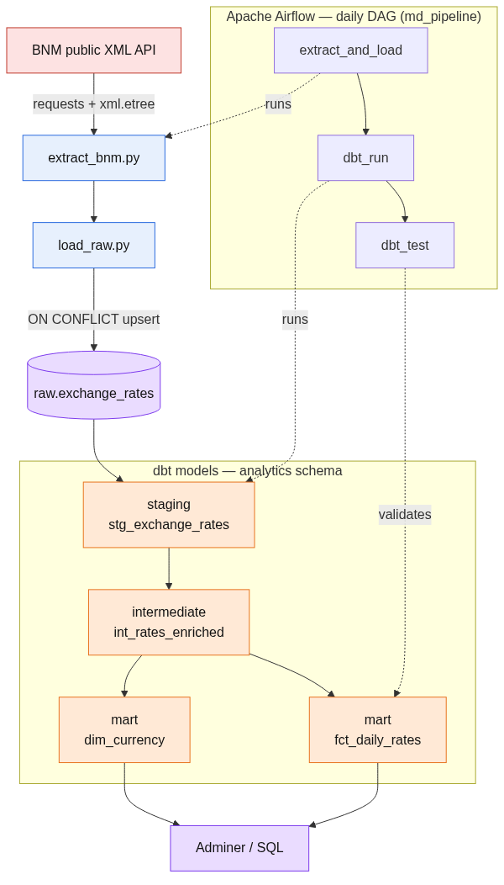

# Project Overview

## What I built

I built an end-to-end ELT data pipeline around a real public dataset: the daily
official exchange rates published by the National Bank of Moldova (BNM). The
pipeline extracts the rates from the bank's public API, lands them in a
PostgreSQL warehouse, transforms them with dbt into an analytics-ready star
schema, and runs the whole thing on a daily schedule orchestrated by Apache
Airflow. Everything is containerized, so the entire stack comes up with a single
`docker compose up`.

My goal was to build a compact but realistic project that touches every stage of
a modern data platform: ingestion, storage, transformation, testing,
orchestration, and continuous integration.

## Why this project

I wanted a data source that is public, stable, and easy to reason about, but
still rich enough to model properly. Daily exchange rates fit well: they have a
natural grain (one rate per currency per day), they support derived metrics
(daily change, percentage change), and they map cleanly onto a fact-and-
dimension model. Using a Moldovan source also keeps the project grounded in a
real, locally relevant dataset.

## Architecture

## How it works, step by step

1. **Extraction.** A small Python module calls the BNM endpoint for a given date
   and parses the XML response into clean records. It uses only `requests` and
   the standard library, and it handles HTTP errors and empty responses
   gracefully.
2. **Raw load.** The records are written into a `raw.exchange_rates` table. The
   load is idempotent: the primary key is `(rate_date, char_code)` and inserts
   use `ON CONFLICT ... DO UPDATE`, so re-running a day never creates
   duplicates.
3. **Transformation.** dbt models the data in three layers. Staging is a cleaned
   one-to-one view of the raw table. The intermediate layer adds derived metrics
   per currency with window functions (daily delta, percentage change, weekend
   flag). The marts layer produces a `dim_currency` dimension and a
   `fct_daily_rates` fact at the grain of one row per date and currency.
4. **Testing.** Thirteen dbt tests run on every build: not-null and unique on the
   keys, a relationship test from the fact to the dimension, and a custom test
   that enforces positive rates.
5. **Orchestration.** An Airflow DAG runs the three steps in order on a daily
   schedule, with retries and its own metadata database kept separate from the
   warehouse. Each run passes its logical date into ingestion, so historical
   backfills work and stay idempotent.
6. **Continuous integration.** A GitHub Actions workflow lints the SQL with
   sqlfluff and runs `dbt build` against an ephemeral Postgres on every push.

## Key decisions I made

- **Idempotency first.** Designing the raw load around an upsert means the
  pipeline is safe to re-run and to backfill, which is essential for a scheduled
  job.
- **Clear layering.** Keeping staging, intermediate, and marts separate makes the
  transformations easy to read, test, and extend.
- **Isolation.** dbt runs in its own virtual environment inside the Airflow image
  so its dependencies never clash with Airflow's, and Airflow's metadata lives in
  a separate database from the analytics data.
- **Configuration over hardcoding.** All connection details and credentials come
  from environment variables kept in a local `.env` file that is never committed.
- **Reproducibility.** The whole stack is defined in Docker Compose so it behaves
  the same on any machine.

## What this demonstrates

- Building an ELT pipeline with a clean staging-to-marts flow and a dimensional
  model.
- Treating data quality as code with automated tests at every layer.
- Orchestrating dependencies with Airflow, including retries, scheduling, and
  backfills.
- Writing idempotent loads that are safe to re-run.
- Containerizing a multi-service stack for one-command reproducibility.
- Setting up continuous integration for a data project.
